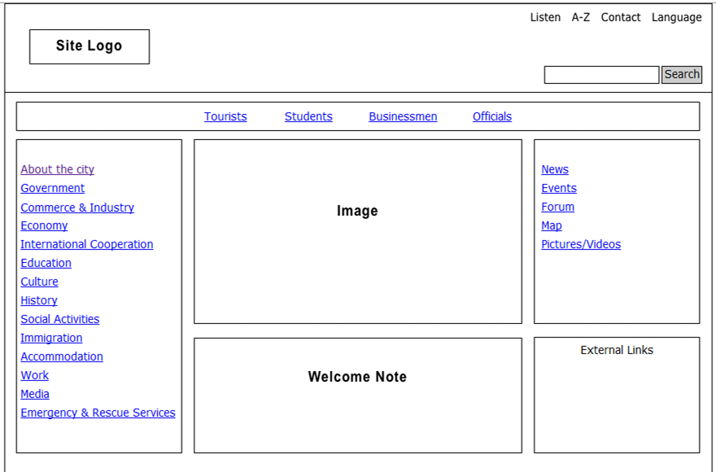

# Semantic Pair Project

Practice building a web page using semantic layout and incremental development.

### Index

* [Learning Objectives](#learning-objectives)
* [Instructions](#instructions)
* [Wireframe](#wireframe)

---

## Learning Objectives

* Develop a semantic layout from a wireframe
* Plan steps ahead of time
* Start from an empty project
* Develop each step on one branch
* Use semantic HTML5 elements
* Write clean and readable code
* Deploy a polished repository

[TOP](#semantic-pair-project)

---

## Instructions

1. Fork this repository, turn on GitHub pages, and clone
1. Study the [wireframe](#wireframe)
1. Plan your user stories in [./development-strategy.md](./development-strategy.md)
1. Develop one story at a time
    1. Create a new branch before beginning each story
    1. Code the story _entirely_. Make sure the code is pretty and everything works
    1. Merge the finished branch into master (on your computer!)
    1. Push the new branch to GitHub
    1. Push `master` to GitHub
    1. Repeat!
1. have a nice day!

[TOP](#semantic-pair-project)

---

## Wireframe

[TOP](#semantic-pair-project)

---
---

### 
